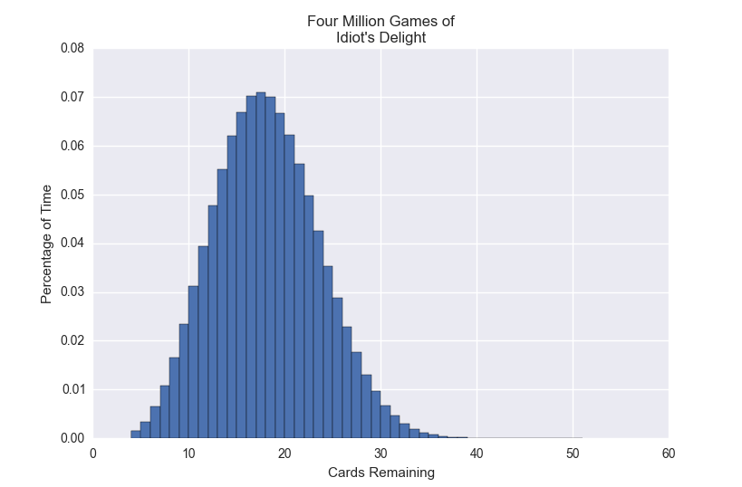

# Aces Up!

The game is described here: https://en.wikipedia.org/wiki/Aces_Up

Simulation of the solitaire card game Aces Up, better known in my family as Idiot's Delight.

After playing 4,000,000 games of Idiot's Delight, I found the resulting distribution: [hist]

| Cards Remaining | Number of Games | Proportion of Games  |
| ------------- |:-------------:| -----:|
| 4 | 6087 | 0.00152175 |
| 5 | 13768 | 0.003442 |
| 6 | 25901 | 0.00647525 |
| 7 | 43363 | 0.01084075 |
| 8 | 66142 | 0.0165355 |
| 9 | 93298 | 0.0233245 |
| 10 | 124602 | 0.0311505 |
| 11 | 157744 | 0.039436 |
| 12 | 190690 |  0.0476725 |
| 13 | 220623 | 0.05515575 |
| 14 | 248140 | 0.062035 |
| 15 | 267392 | 0.066848 |
| 16 | 280623 | 0.07015575 |
| 17 | 283947 | 0.07098675 |
| 18 | 280220 | 0.070055 |
| 19 | 266917 | 0.06672925 |
| 20 | 248995 | 0.06224875 |
| 21 | 225407 | 0.05635175 |
| 22 | 199286 | 0.0498215 |
| 23 | 170469 | 0.04261725 |
| 24 | 141436 | 0.035359 |
| 25 | 115382 | 0.0288455 |
| 26 | 91653 | 0.02291325 |
| 27 | 70308 | 0.017577 |
| 28 | 52422 |  0.0131055|
| 29 | 38357 | 0.00958925 |
| 30 | 27089 | 0.00677225 |
| 31 | 18565 | 0.00464125 |
| 32 | 12145 | 0.00303625 |
| 33 | 7690 | 0.0019225 |
| 34 | 4862 | 0.0012155 |
| 35 | 3027 | 0.00075675 |
| 36 | 1630 | 0.0004075 |
| 37 | 879 | 0.00021975 |
| 38 | 475 | 0.00011875 |
| 39 | 257 | 6.425e-05 |
| 40 | 116 | 2.9e-05 |
| 41 | 49 | 1.225e-05 |
| 42 | 29 | 7.25e-06 |
| 43 | 10 | 2.5e-06 |
| 44 | 3 | 7.5e-07 |
| 45 | 2 | 5e-07 |
| 46 | 0 | 0 |
| 47 | 0 | 0 |
| 48 | 0 | 0 |
| 49 | 0 | 0 |
| 50 | 0 | 0 |
| 51 | 0 | 0 |
| 52 | 0 | 0 |