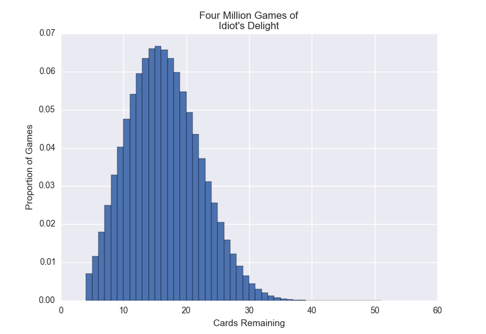

# Aces Up!

The game is described here: https://en.wikipedia.org/wiki/Aces_Up

Simulation of the solitaire card game Aces Up, better known in my family as Idiot's Delight.

After playing 4,000,000 games of Idiot's Delight, I found the resulting distribution:

| Cards Remaining | Number of Games | Proportion of Games  | Odds |
| ------------- |:-------------:|:-----:| ---------:|
| 4 (Win!) | 28228 | 0.007057 | 141.7 |
| 5 | 46627 | 0.01165675 | 85.79 |
| 6 | 71662 | 0.0179155 | 55.82 |
| 7 | 100050 | 0.0250125 | 39.98 |
| 8 | 131644 | 0.032911 | 30.38 |
| 9 | 160826 | 0.0402065 | 24.87 |
| 10 | 124602 | 0.04756975 | 21.02 |
| 11 | 216330 | 0.0540825 | 18.49 |
| 12 | 237785 |  0.05944625 | 16.82 |
| 13 | 253650 | 0.0634125 | 15.77 |
| 14 | 264213 | 0.06605325 | 15.14 |
| 15 | 266394 | 0.0665985 | 15.02 |
| 16 | 262854 | 0.0657135 | 15.22 |
| 17 | 253843 | 0.06346075 | 15.76 |
| 18 | 239526 | 0.0598815 | 16.7 |
| 19 | 190279 | 0.05479625 | 18.25 |
| 20 | 197549 | 0.04938725 | 20.25 |
| 21 | 174628 | 0.043657 | 22.91 |
| 22 | 149221 | 0.03730525 | 26.81 |
| 23 | 124686 | 0.0311715 | 32.08 |
| 24 | 102202 | 0.0255505 | 39.14 |
| 25 | 81777 | 0.02044425 | 48.91 |
| 26 | 63584 | 0.015896 | 62.91 |
| 27 | 49047 | 0.01226175 | 81.55 |
| 28 | 36387 |  0.00909675 | 109.93 |
| 29 | 26029 | 0.00650725 | 153.67 |
| 30 | 18075 | 0.00451875 | 221.3 |
| 31 | 12248 | 0.003062 | 326.58 |
| 32 | 8392 | 0.002098 | 476.64 |
| 33 | 5346 | 0.0013365 | 748.22 |
| 34 | 3307 | 0.00082675 | 1209.56 |
| 35 | 1988 | 0.000497 | 2012.07 |
| 36 | 1147 | 0.00028675 | 3487.36 |
| 37 | 604 | 0.000151 | 6622.52 |
| 38 | 346 | 8.65e-05 | 11560.69 |
| 39 | 175 | 4.375e-05 | 22857.14 |
| 40 | 80 | 2e-05 | 50000.0 |
| 41 | 52 | 1.3e-05 | 76923.08 |
| 42 | 16 | 4e-06 | 250000.0 |
| 43 | 12 | 3e-06 | 333333.33 |
| 44 | 3 | 7.5e-07 | 1333333.33 |
| 45 | 2 | 5e-07 | 2000000.0 |
| 46 | 0 | 0 |  |
| 47 | 0 | 0 |  |
| 48 | 1 | 2.5e-07 | 4000000.0 |
| 49 | 0 | 0 |  |
| 50 | 0 | 0 |  |
| 51 | 0 | 0 |  |
| 52 | 0 | 0 |  |